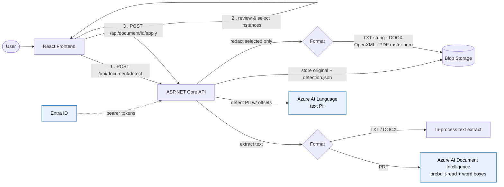

# HHSC / MMRS Document Redaction System

A **React + .NET 10** web application that uses **Microsoft Azure AI Foundry** services to help reviewers de-identify sensitive clinical documents before they reach the Maternal Mortality Review System (MMRS) committee. The reviewer sees every detected PII instance highlighted, chooses exactly which ones to remove, and the app redacts **only those** — keeping the original file format.

## Architecture



- Auth to Blob Storage, Azure AI Language, and Azure AI Document Intelligence uses **Entra ID** (`DefaultAzureCredential`) — no account keys or subscription keys.
- Detection is uniform: **Azure AI Language text PII** runs over the extracted text and returns each instance with a character offset, which powers the highlight preview and per-instance selection.
- Only PDFs call **Document Intelligence** (for per-word page coordinates used to burn boxes).

### Redaction pipeline (two phases)

| Phase | Step | What happens |
|-------|------|-------------|
| Detect | 1 | Original stored in `original/<jobId>.<ext>`; text extracted (TXT decode · DOCX OpenXML · PDF Document Intelligence) |
| Detect | 2 | Azure AI Language **text PII** detects every instance with offsets; PDF instances also get page boxes. Result saved to `state/<jobId>.json` and returned |
| Review | 3 | The UI highlights all instances (pre-selected). The reviewer unchecks anything to keep — e.g. keep the patient, redact the nurse and doctor |
| Apply | 4 | Only the selected instances are redacted **in the original format**: TXT string mask, DOCX run edit (OpenXML), PDF rasterize + opaque bars. Output stored in `redacted/<jobId>.<ext>` |

### Documents supported

`PDF · DOCX · TXT` — up to **50 MB**.

> Redacted PDFs are rasterized so the masked text is genuinely removed (not just covered).
> A side effect is that the redacted PDF's text is no longer selectable — the intended
> behavior for a released, de-identified document.

> **DOCX redaction covers body text only in this POC; headers, footers, text boxes,
> comments, and footnotes are not yet scanned.**

> **PDF redaction requires `Azure:DocumentIntelligence:Endpoint` to be set.** Without it
> the app still starts and TXT/DOCX redaction works; a PDF upload will return a clear
> error message instead of crashing.

---

## Prerequisites

| Tool | Version |
|------|---------|
| .NET SDK | 10.0 |
| Node.js | 24 LTS |
| Azure subscription | — |

---

## Azure Resource Setup

### 1. Azure AI Language

1. Create (or reuse) an **Azure AI Language** resource.
2. Copy its endpoint, e.g. `https://<resource>.cognitiveservices.azure.com`, into `Azure:Language:Endpoint`.
3. Grant the app identity the **Cognitive Services User** role on the resource (Entra ID auth; no key needed).

### 2. Azure AI Document Intelligence (required for PDF)

1. Create an **Azure AI Document Intelligence** (Form Recognizer) resource.
2. Copy its endpoint into `Azure:DocumentIntelligence:Endpoint`.
3. Grant the app identity the **Cognitive Services User** role on the resource.

> Only PDF redaction uses Document Intelligence (for word coordinates). TXT and DOCX are
> handled fully in-process and don't require it.

### 3. Azure Blob Storage

1. Create a **Storage Account**.
2. Copy the **Blob service URI** from the storage account overview, for example `https://<account>.blob.core.windows.net`.
3. Optionally create the containers `documents-unredacted` and `documents-redacted` (the app creates them automatically if absent).
4. Grant the app identity the **Storage Blob Data Contributor** role on the storage account.
5. For local development, the signed-in user should have that same role on the storage account.

---

## Configuration

### Option A — User Secrets (local development)

```bash
cd backend/DocumentRedaction.API

dotnet user-secrets set "Azure:Language:Endpoint"              "https://<language>.cognitiveservices.azure.com"
dotnet user-secrets set "Azure:DocumentIntelligence:Endpoint"  "https://<doc-intel>.cognitiveservices.azure.com"
dotnet user-secrets set "Azure:Storage:ServiceUri"             "https://<account>.blob.core.windows.net"
```

Make sure you are signed in with an Azure identity that has access to the resources, for example via `az login`, Visual Studio, or VS Code.
If you want to pin the login to the tenant used for this app, sign in with tenant `d64bea8b-d6b8-4662-b544-534df0893609`.

### Option B — Environment variables

```
Azure__Language__Endpoint=https://<language>.cognitiveservices.azure.com
Azure__DocumentIntelligence__Endpoint=https://<doc-intel>.cognitiveservices.azure.com
Azure__Storage__ServiceUri=https://<account>.blob.core.windows.net
Azure__Storage__UnredactedContainerName=documents-unredacted
Azure__Storage__RedactedContainerName=documents-redacted
```

### Option C — Docker Compose

Copy `.env.example` to `.env` and fill in your values, then see *Running with Docker Compose* below.
The backend still uses identity-based auth for Storage, so the container must have access to an Azure identity source that can obtain tokens.

---

## Running locally (development)

### Backend

```bash
cd backend/DocumentRedaction.API
dotnet run
# Listening on http://localhost:5000
```

### Frontend

```bash
cd frontend
npm install
npm run dev
# Vite dev server on http://localhost:5173
# /api/* requests are proxied to http://localhost:5000
```

Open **http://localhost:5173** in your browser.

---

## Running with Docker Compose

```bash
cp .env.example .env
# Edit .env with your Azure credentials

docker compose up --build
```

- Frontend: **http://localhost:5173**
- Backend API: **http://localhost:5000**

---

## Project structure

```
hhsc-document-redaction/
├── backend/
│   └── DocumentRedaction.API/
│       ├── Controllers/
│       │   └── DocumentController.cs              # detect / apply / stream endpoints
│       ├── Models/
│       │   └── RedactionModels.cs                 # Detection / Apply records
│       ├── Services/
│       │   ├── BlobStorageService.cs              # Blob storage + job state
│       │   ├── TextPiiClient.cs                   # Azure AI Language text PII
│       │   ├── DocumentLayoutService.cs           # Azure AI Document Intelligence (PDF)
│       │   ├── TxtDocumentProcessor.cs            # TXT extract + string-mask redact
│       │   ├── DocxDocumentProcessor.cs           # DOCX extract + OpenXML redact
│       │   ├── PdfDocumentProcessor.cs            # PDF extract + raster-burn redact
│       │   ├── DocumentRedactionOrchestrator.cs   # Detect/apply orchestrator
│       │   └── I*.cs                              # Service interfaces
│       ├── Program.cs
│       ├── appsettings.json
│       └── Dockerfile
├── frontend/
│   ├── src/
│   │   ├── components/
│   │   │   ├── DocumentUpload.tsx                 # Drag-and-drop upload zone
│   │   │   ├── LoadingSpinner.tsx                 # Processing indicator
│   │   │   └── RedactionReview.tsx                # Highlight preview + instance checklist
│   │   ├── services/
│   │   │   └── api.ts                             # detect / apply fetch wrappers
│   │   ├── types/
│   │   │   └── index.ts                           # TypeScript interfaces
│   │   └── App.tsx
│   ├── nginx.conf                                 # Production reverse-proxy config
│   ├── vite.config.ts                             # Dev proxy: /api → :5000
│   └── Dockerfile
├── docker-compose.yml
├── .env.example
└── README.md
```

---

## API reference

### `POST /api/document/detect`

Accepts a `multipart/form-data` request with a single `file` field. Detects PII and returns
every instance for review — nothing is redacted yet.

**Response `200 OK`**

```json
{
  "jobId": "a1b2c3...",
  "fileName": "admission-record.pdf",
  "fileSizeBytes": 245120,
  "contentType": "application/pdf",
  "extractedText": "Patient Jane Doe was admitted on 01/15/2024...",
  "pageCount": 1,
  "pages": [{ "page": 1, "width": 8.5, "height": 11 }],
  "entities": [
    {
      "id": "e0",
      "text": "Jane Doe",
      "category": "Person",
      "subCategory": null,
      "confidenceScore": 0.99,
      "offset": 8,
      "length": 8,
      "boxes": [{ "page": 1, "x": 0.12, "y": 0.08, "width": 0.14, "height": 0.02 }]
    }
  ],
  "processedAt": "2024-01-15T14:32:00Z"
}
```

### `POST /api/document/{jobId}/apply`

Redacts only the selected instances, preserving the original format.

```json
// request body
{ "selectedEntityIds": ["e0", "e2"] }
```

**Response `200 OK`**

```json
{
  "jobId": "a1b2c3...",
  "redactedUrl": "https://storage.../redacted/a1b2c3.pdf",
  "redactedCount": 2,
  "fileName": "admission-record.pdf",
  "processedAt": "2024-01-15T14:33:10Z"
}
```

### `GET /api/document/{jobId}/original` · `GET /api/document/{jobId}/redacted`

Stream the original upload and the redacted output for a job.

**Errors** — `400 Bad Request` (unsupported type / unknown job) · `500 Internal Server Error` (Azure service error).

---

## Security considerations

- Documents are stored in **private** Blob Storage containers. No public access is configured.
- SAS tokens are generated with minimal required permissions and a 1-hour expiry.
- API keys are never committed to source control — use User Secrets or environment variables.
- Storage access uses Entra ID / managed identity, not storage account keys.
- The `RequestSizeLimit` attribute limits uploads to 50 MB at the controller level.
- CORS is restricted to the configured `AllowedOrigins` list.
- The frontend validates file type and size client-side before submitting.

---

## Compliance notes

This application is designed to support DSHS abstractors performing HIPAA-mandated de-identification (45 CFR § 164.514) of maternal mortality records before committee review. The Azure AI Language PII detection service identifies the following entity categories (among others):

`Person · PersonType · PhoneNumber · Organization · Address · Email · URL · DateTime · Age · MedicalTreatment · Diagnosis`

Review the redacted output carefully before sharing with committee members. This tool is a **decision-support aid** — final de-identification responsibility rests with the reviewing abstractor.
